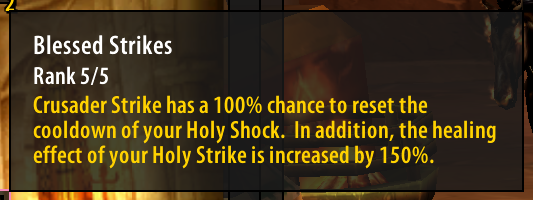
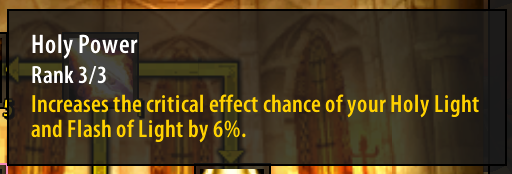
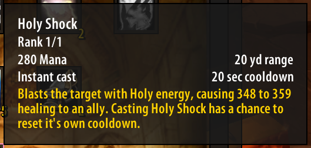
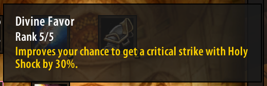
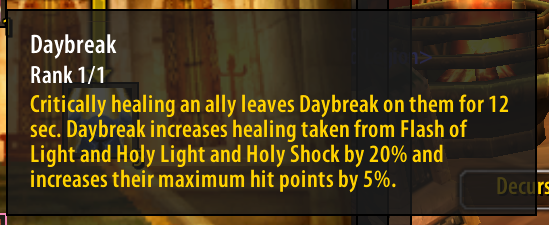
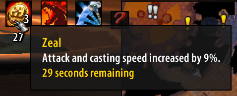
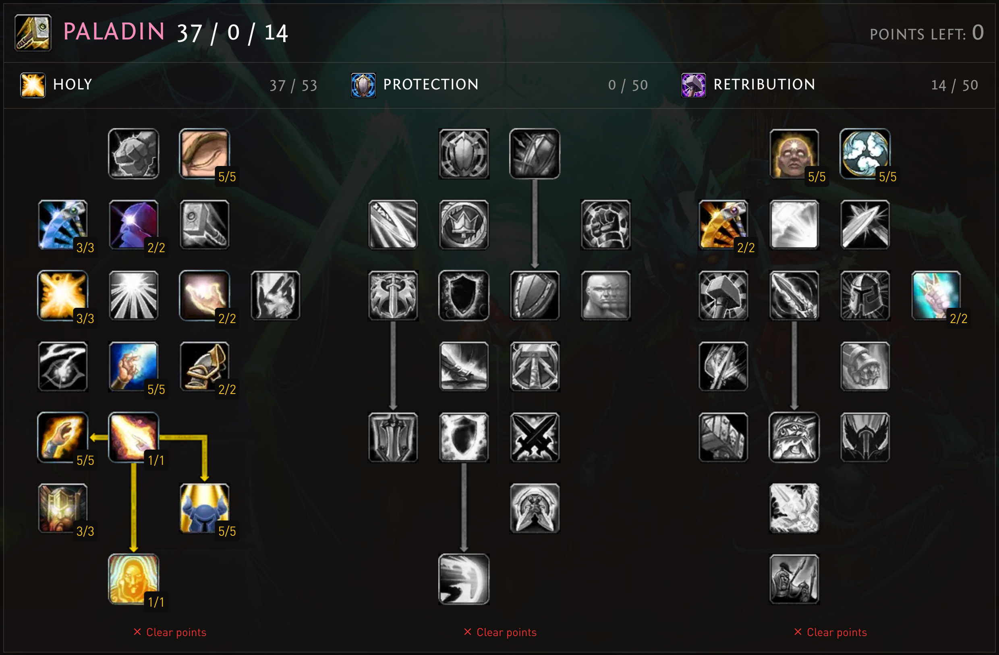

This guide is primarily focused for raiding Holy Paladins on [Turtle Wow](https://turtle-wow.com)

> This is based on my experience raiding AQ40 and Naxx since the release of the 1.17.2 patch. *These may change*

### tl;dr

- Keep `Holy Judgement` buff active
- Keep a seal up, so that you can judge whenever needed.
- `Holy Shock` whenever it is ready
- `Crusader Strike` to reset `Holy Shock` and stack `Zeal`

### Talents and Buffs

Let's take a look at the talents and buffs and how they work together to make this style of healing possible.

|           |            |
|-----------|------------|
||`Blessed Strikes` is the talent that gives us the guaranteed `Holy Shock` reset.|
||`Holy Power` is another great passive crit buff on both `Holy Light` and `Flash of Light`|
||`Holy Judgement` is the talent and cast-time reduction buff for `Holy Light` and this buff has no expiration, so you can always keep it queued up.|
||`Holy Shock` is the talent that enables its use, note that it has a chance to reset its own cooldown.|
||`Divine Favor` has been redesigned and now just gives you a straight-up 30% added crit chance to `Holy Shock`|
||`Daybreak` is the talent and also the name of the buff that is put on your target if you crit.|
||`Zeal` stacks up to three times. This buff is triggered by `Crusader Strike`

For an honorable mention, there is a small smart-heal that comes from using `Holy Strike`, but honestly I have found that I never have a good time to use it in raid. It is very nice in solo content, however. 

[My current talents](https://talents.turtle-wow.org/paladin?points=AoaAYQFQpAYoBAAAAAAAAAAAAAAAFoQAACAAAAAAAAA%3D)

### Melee Healing Summary

When I first read the [changes](https://forum.turtle-wow.org/viewtopic.php?p=102974#p102969) for Holy Paladins in 1.17.2, I imagined myself as being able to just run into the fray and start doing damage and healing everyone around me in a frenzied explosion of holy love.

When the patch was released I immediately began testing various talents and playstyles to be able to achieve this dream.

Unfortunately, I found that it doesn't exactly work the way I had hoped. That being said, I have been able to find a very engaging and rewarding playstyle that is much more balanced.

There are many situations where it just makes more sense to heal the way we have always done in the past - just spam `Flash of Light` and `Holy Shock` if in range. However, there are some situations where melee healing shines! 

### Decisions, Decisions...

Generally, for **trash mobs/adds** that will die fairly quickly, it doesn't make sense to try to go full melee. 

Mobs that die quickly are a great place to refresh `Holy Judgement` by judging any mob you can easily reach. As for the seal of choice, it will probably be `Seal of Light` since your ret or prot paladins will likely be judging wisdom. 
> I do not know if `Seal of Light` benefits from your +healing or not, but at the least its healing will be credited to you as the healer

If a mob is close to you and you are able to `Crusader Strike`, do it, but try to do it after putting `Holy Shock` on cd. `Crusader Strike` will reset the cd on `Holy Shock` as well as giving you a stack of `Zeal`.
> It is easy to fall into the trap of chasing mobs just to `Crusader Strike` them to try to keep `Zeal` stacks up, but it is usually not worth it - use self-control!

In the case of mobs that constantly fear or stun in melee range, it is generally best to just stay at max range and spam `Flash of Light` - you might be able to work `Crusader Strike` and `Judgement of Light` in to keep `Zeal` and `Holy Judgement` up - but do not do it if you are going to be stunned or feared when you could have avoided the mechanic by being at range.

The best case scenario is any mob that is "melee-friendly" and will live long enough to make it worthwhile. 

In this case, you will want to start the engagement with `Seal of Light` and `Holy Judgement` already up.

While the tank runs in, cast `Holy Shock` on them.
> `Holy Shock` has the highest chance to crit and you can use it while positioning since it is instant cast. If the `Holy Shock` crits, you will place `Daybreak` on the tank, which is a big boon for you and any other Holy Paladins who are healing the tank, not to mention it gives the tank an additional 5% HP.

Now, you have to assess the situation - it could be (and it happens quite often) that `Holy Shock` reset and you can cast it again - look for anyone else who needs a heal or just cast it on the tank again - if it didn't crit the first time, maybe it will this time.

Next you should be close enough to get a `Crusader Strike` on the mob. 

Now, you have `Zeal` and another `Holy Shock`, so again cast `Holy Shock` and look to see if you have a reset - if so, cast it again and do this until it goes on cd.

If `Holy Shock` is on cd, decide if the tank or someone else needs a big heal and if so, use `Holy Light` - the cast time is just like casting `Flash of Light` due to `Holy Judgement`.

Any time you cast `Holy Light` you should be thinking that you need to judge again to get `Holy Judgement` back up.

At this point, it is pretty much rinse and repeat - weave your `Crusader Strike` in to keep `Zeal` up, but more importantly to reset the cd on `Holy Shock`

`Holy Shock` is your bread-and-butter and this is what you want to be thinking about at all times - unfortunately, there is no in-game trigger that shows that you have gotten a cd reset, so just always glance at your `Holy Strike` cd during the GCD to decide if you will be able to cast it again or not.
